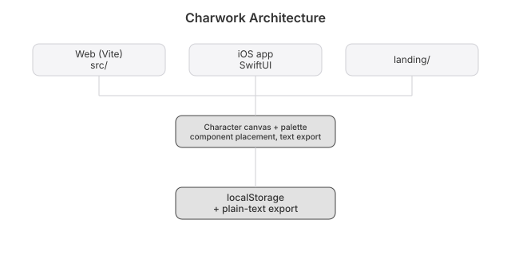

# Charwork


Wireframes made of characters.

Pick a component. Stamp it on a monospace grid. Copy the result as plain text. It pastes into a commit message, a code comment, a chat. No image, no export dialog, no design tool.

## Run

```bash
npm install && npm run dev
```

## Features

- 23 component presets: Button, Input, Select, Checkbox, Radio, Toggle, Table, Modal, Browser, Card, Navbar, Tabs, Progress, Icon, Image, Divider, Alert, Breadcrumb, Avatar, List, Stepper, Rating, Skeleton
- Click to place on a 100×50 character grid
- See it before you place it
- Export `.txt` or copy to clipboard
- Undo and redo, 50 steps deep
- Zinc dark theme, Inter, indigo accents

## Architecture



## Stack

Vite 6 and React 19. No UI libraries.

## License

MIT 2026 Joshua Trommel

## Live

[wiretext.heyitsmejosh.com](https://wiretext.heyitsmejosh.com)

## Whitepaper

[Technical whitepaper](WHITEPAPER.md)

## API and agent tools

An agent can drive this app. [`docs/API.md`](docs/API.md) lists the HTTP surface, where there
is one, and the WebMCP tools registered on `document.modelContext`. Tools come in three kinds:
read-only, writes you can undo, and the few that ask a human first.
